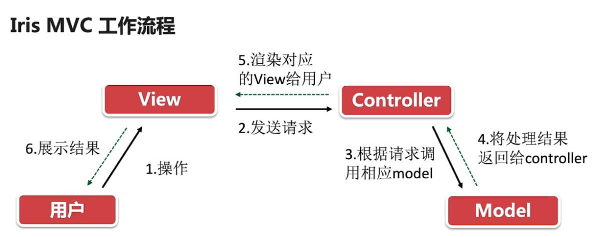

## Iris MVC

### MVC

Model-View-Controller

* **Model**: 模型，应用程序的主体部分，包括业务逻辑，数据操作和数据模型
* **View**: 视图，用户与之交互的页面
* **Controller**: 控制器，接收来自界面的请求 并交给模型进行处理

### Iris MVC 目录

* datamodels: 存放结构体
* repositories：数据库操作，实现的接口，创建封装类
* services：
* web：
    * controllers：
    * views：

### Iris MVC 入口文件main.go