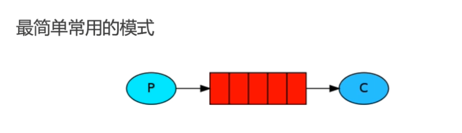
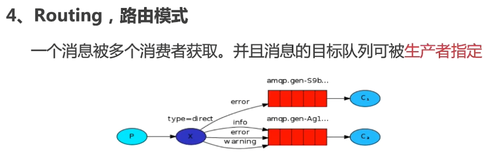

### RabbitMQ

* RabbitMQ 是面向消息的中间件，用于组件之间的解耦，消息的发送者和消费者之间无强依赖关系
* 特点：高可用，扩展性，多语言客户端，管理界面等
* 主要使用场景：流量削峰，异步处理，应用解耦等

### 安装

1. 安装 Erlang，https://www.erlang.org/downloads
2. 安装 RabbitMQ，https://www.rabbitmq.com/docs/download

#### 核心概念

* Virtual Host: 数据隔离 区分队列 开发/测试环境可以通过VH进行逻辑隔离
* Connection: 连接
* Exchange: 交换机 进行中转
* Channel:
* Queue: 绑定交换机 接收消息 临时存储消息
* Binding: 队列绑定到交换机中

#### 工作模式 六种

1. **Simple 模式**


* 封装RabbitMQ
    * 属性：
        * `conn *amqp.Connection`
        * `channel *amqp.Channel`
        * `QueueName string`
        * `Exchange string`
        * `Key string`
        * `Mqurl string`
            * 连接格式：`amqp://user:password@ip:port/vhost`
    * Simple 模式下创建实例对象，exchange 和 key 传空值，exchange 使用default配置

    * 方法：
        * PublishSimple:
            * 申请队列 `r.channel.QueueDeclare`
            * 发送消息到队列中 `r.channel.Publish`
        * ConsumeSimple:
            * 申请队列 `r.channel.QueueDeclare`
            * 接收消息 `r.channel.Consume`
            * 使用协程处理消息
                ```go
                // 3. 消费消息
                forever := make(chan bool)

                // 启用协程处理消息
                go func() {
                    for d := range msg {
                        // 逻辑函数
                        log.Printf("Received a message: %s", d.Body)
                        fmt.Println(d.Body)
                    }
                }()

                log.Printf("[*] Waiting for messages, To exit press CTRL + C")
                // 阻塞主线程，让 goroutine 持续运行
                <-forever
                ```
2. **工作模式**

* 使用场景：生产消息的速度大于消费速度时，使用work模式可以增加系统的性能和处理能力，起到负载均衡作用

* 队列消息挤压较大时，可以开启多个消费端来处理挤压消息

3. **Publish/Subscribe 订阅模式**

* 消息被路由传递给多个队列，一个消息被多个消费者获取
* 封装RabbitMQ
    * 方法：
        * 创建订阅模式的RabbitMQ: 需要指定交换机Exchange，queueName应为空，key为空
        * PublishPub:
            * 创建交换机 `r.channel.ExchangeDeclare`
            * 发送消息 `r.channel.Publish`
        * ReceiveSub:
            * 创建交换机 `r.channel.ExchangeDeclare`
            * 创建队列  `r.channel.QueueDeclare`
            * 绑定队列到交换机中 `r.channel.QueueBind`
            * 接收消息 `r.channel.Consume`
            * 使用协程处理消息

4. **Routing 路由模式**

* 从生产端指定消费端进行消费
* 与订阅模式代码基本相同，将`Exchange`的`kind`从`fanout`修改为`direct`

5. **Topic 话题模式**

* 消息的目标queue可用BindingKey以通配符的方式指定(#表示一个或多个词，*表示一个词)
* Exchange的类型需要修改为`topic`

    ```go
    rabbitmq1 := RabbitMQ.NewRabbitMQTopic("newProductTopic", "#")
    rabbitmq1.ReceiveTopic()
    ```

    ```go
    rabbitmq2 := RabbitMQ.NewRabbitMQRouting("newProductRouting", "gf_test_2")
    rabbitmq2.ReceiveRouting()
    ```